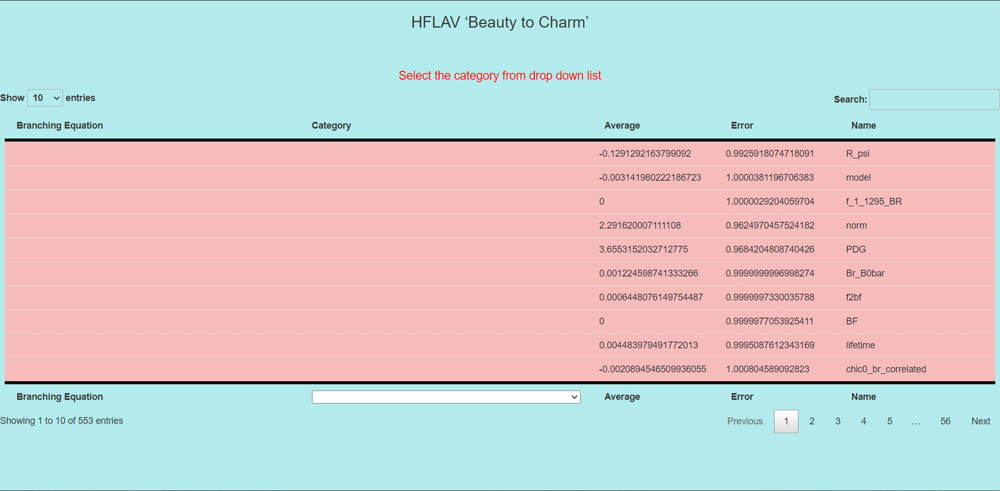
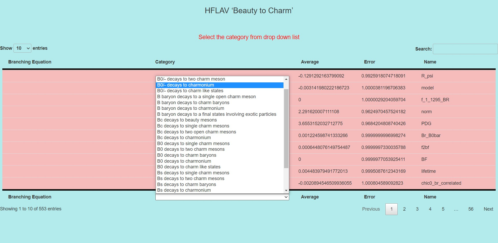
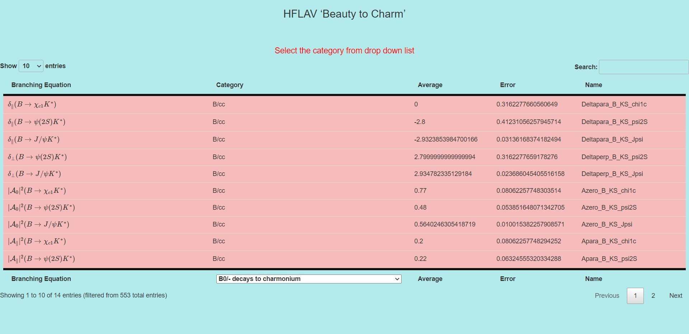
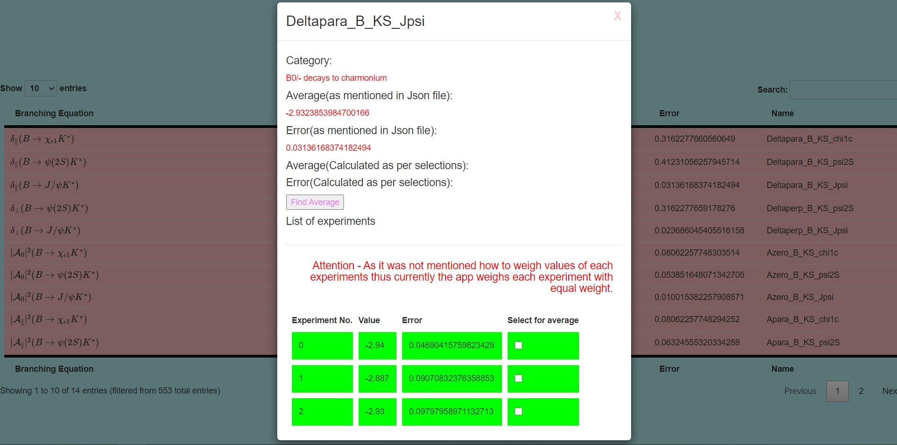
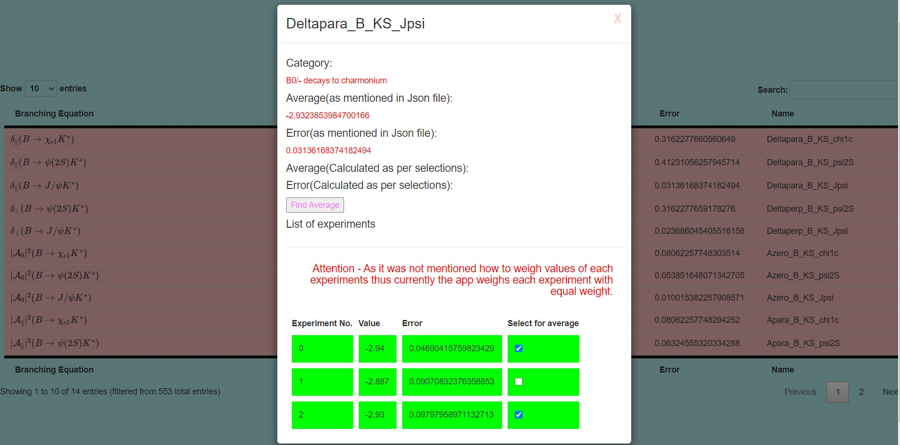
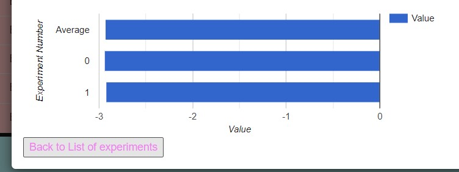

# hflav - Beauty to Charm
### Live Demo - https://hflav.herokuapp.com/
### Technologies used and work done
<h4> HTML, CSS , jQUERY , MATHJAX (FOR LATEX) , DATATABLES (FOR TABLES) , GOOGLE CHARTS (FOR CHARTS) </h4>

### Working

  <h4> Initial View on opening Webpage </h4>
  

  
  
  
<h4> Select category of transformation from drop down list </h4>
  

  
  
  
<h4> Selected category loads </h4>
  <h5 style="color:red;"> Warning - sometimes latex takes time to render, so you can refresh once if it doesn't render properly </h5>
  

  
  
<h4> Click on a row of the table to intereact with that branching equation, it opens a modal where you can select few measurements of that euation and take its average </h4>
  

  
  
<h4> Select checkboxes of the measurments you want to include in your average,click 'find average' button </h4>
  

  
  
<h4> Average error and average value shows up, along with a chart with avg value and all other measurements from different experiments </h4>
  

  
  
<h4> click "back to list of experiments' if you want to again choose some different set of experiments </h4>
  
  

